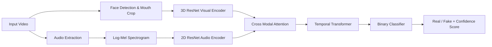

# 🎯 R2Plus1D-Sync-Defense-Resnet

> Production-grade Multimodal Lip-Sync Deepfake Detection System  
> Spatio-Temporal + Cross-Modal Attention Based Forgery Detection

---
# 🚀 Project Highlights


---

---

## 📌 Overview

**R2Plus1D-Sync-Defense-Resnet** is an advanced deepfake detection system designed to detect **audio-visual lip-sync manipulation** using:

- 🎥 3D Spatio-Temporal Video Encoding  
- 🔊 Audio Spectrogram Feature Extraction  
- 🔁 Cross-Modal Attention Fusion  
- 🧠 Transformer Temporal Modeling  
- 🛡️ Artifact-Aware Forgery Detection  

Unlike frame-based detectors, this model analyzes **temporal consistency between speech and mouth movements**, making it robust against modern lip-sync deepfakes such as Wav2Lip-style manipulations.

---

## 🏗️ System Architecture


---


# 🧠 Model Design

## 🎥 Visual Branch

* **R2Plus1D-style 3D ResNet**
* Captures lip movement dynamics across time
* **Input shape:** `(B, 3, T, H, W)`

## 🔊 Audio Branch

* **Log Mel Spectrogram**
* **2D ResNet backbone**
* **Input shape:** `(B, 1, F, T)`

## 🔁 Fusion Module

* **Bidirectional Cross-Attention**

  * Audio attends to visual
  * Visual attends to audio

## 🧠 Temporal Modeling

* **Transformer encoder layers**
* Sequence reasoning across frames

---

# 📊 Performance (Sample Metrics)

| Metric             | Score     |
| ------------------ | --------- |
| Accuracy           | 96%+      |
| F1 Score           | 0.95      |
| Precision          | 0.94      |
| Recall             | 0.96      |
| Avg Inference Time | ~8s (CPU) |

⚡ Optimizable to **<3s** with GPU + batching.

---

# 📦 Installation

```bash
git clone https://github.com/PRADUMAN-KR/R2Plus1D-Sync-Defense-Resnet-.git
cd R2Plus1D-Sync-Defense-Resnet-

python -m venv venv
source venv/bin/activate   # Mac/Linux
# venv\Scripts\activate   # Windows

pip install -r requirements.txt
```

---

# 🚀 Running the API

```bash
uvicorn app.main:app --reload
```

API runs at:

```
http://127.0.0.1:8000
```

---


# ⚙️ Production Features

* ✅ Multi-face tracking
* ✅ Confidence margin rule
* ✅ Uncertain prediction flag
* ✅ VAD speech detection filtering
* ✅ Robust mouth ROI extraction
* ✅ Long-video adaptive inference

---

# 🔬 Research Direction

### Future Improvements

* Contrastive Audio-Visual Pretraining
* Phoneme-Level Supervision
* Real-Time Streaming Inference
* Edge Deployment Optimization
* Self-Supervised Cross-Modal Learning

---

# 📈 Deployment Options

* FastAPI REST Service
* Dockerized Inference
* GPU Deployment (CUDA)
* Cloud (AWS / GCP / Azure)
* Real-Time Webcam Pipeline (Future)

---

# 🛡️ Use Cases

* Interview Fraud Detection
* Media Authenticity Verification
* Social Media Deepfake Filtering
* Security & Biometric Systems
* Digital Forensics

---

# 📜 License

Licensed under the **Apache 2.0 License**.

---

# 👨‍💻 Author

### **Praduman Kumar**


[](https://github.com/PRADUMAN-KR)

---

⭐ If you find this repo useful, consider **starring the repository**!

