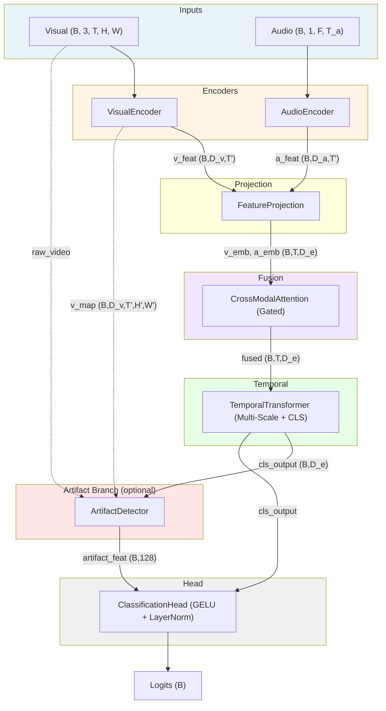
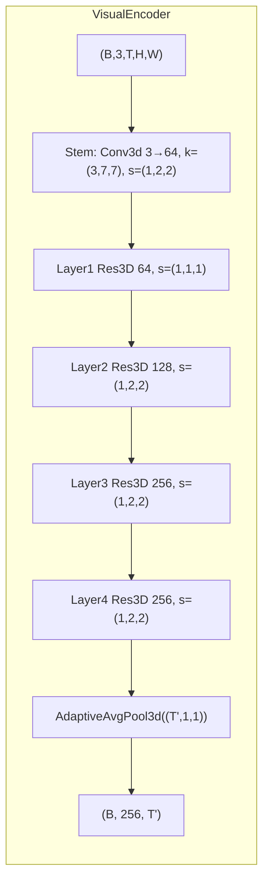
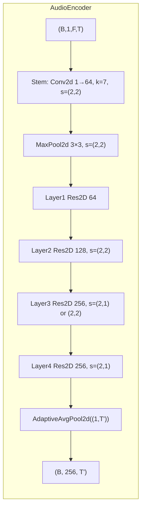
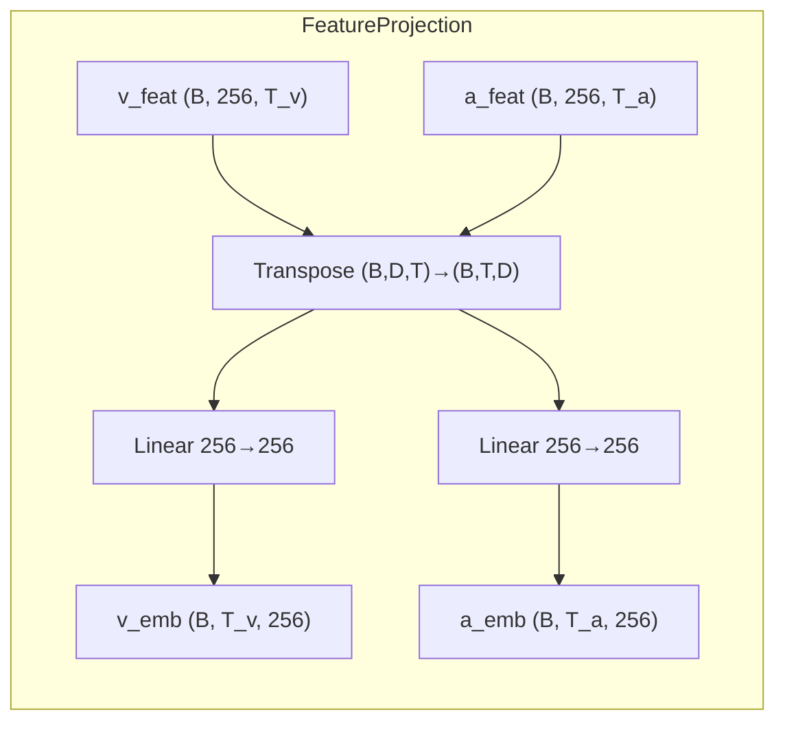
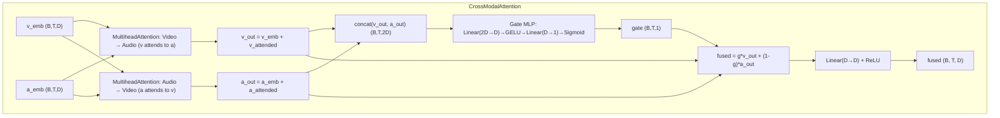
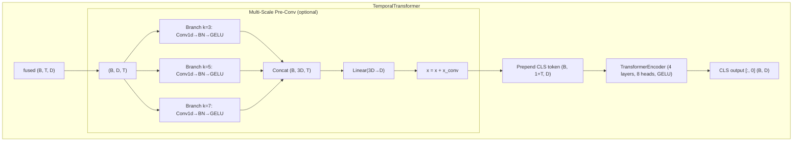
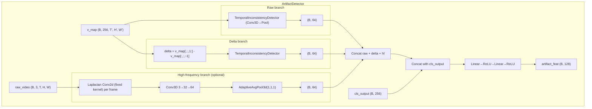
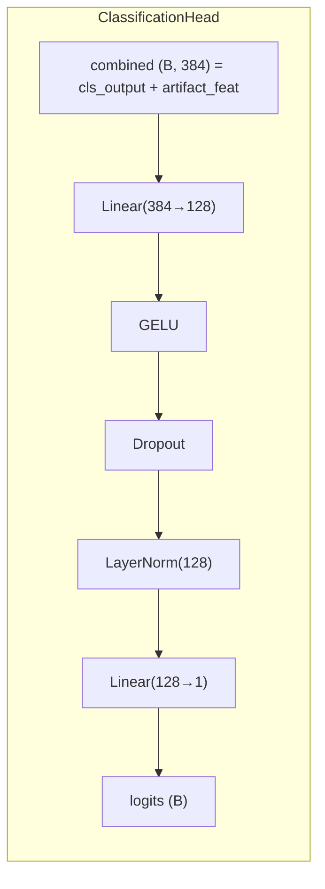
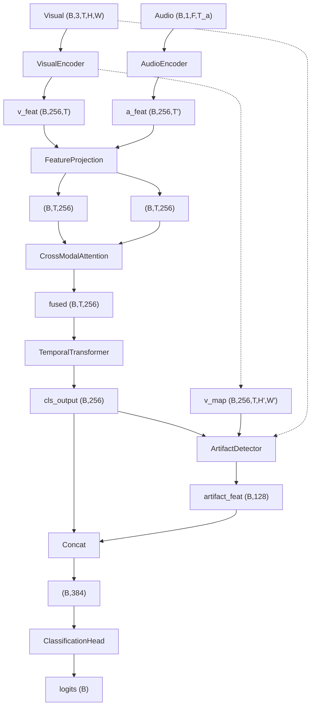

# Lip-Sync Detection Model — Architecture (Post-Improvements)

Detailed Mermaid diagram of the full pipeline after temporal resolution, gated fusion, multi-scale temporal conv, artifact high-freq branch, and classifier updates.

---

## Full detailed diagram: single flowchart (top to bottom, every layer)

```mermaid
flowchart TB
    subgraph IN["INPUTS"]
        V["Visual (B, 3, T, H, W)"]
        A["Audio (B, 1, F, T_a)"]
    end

    subgraph VE["VISUAL ENCODER — 3D ResNet-style"]
        V --> VE_C["Conv3d 3→64 k=3,7,7 s=1,2,2 pad=1,3,3"]
        VE_C --> VE_BN1["BatchNorm3d 64"]
        VE_BN1 --> VE_R1["ReLU"]
        VE_R1 --> VE_MP["MaxPool3d k=1,3,3 s=1,2,2"]
        VE_MP --> VE_L1["ResBlock3D 64→64 s=1,1,1"]
        VE_L1 --> VE_L2["ResBlock3D 64→128 s=1,2,2"]
        VE_L2 --> VE_L3["ResBlock3D 128→256 s=1,2,2"]
        VE_L3 --> VE_L4["ResBlock3D 256→256 s=1,2,2"]
        VE_L4 --> VE_D["Dropout3d"]
        VE_D --> VE_FM["feature_map (B,256,T',H',W')"]
        VE_FM --> VE_AP["AdaptiveAvgPool3d T',1,1"]
        VE_AP --> VE_SQ["squeeze -1,-2"]
        VE_SQ --> v_feat["v_feat (B, 256, T')"]
        VE_FM --> v_map["v_map (B,256,T',H',W')"]
    end

    subgraph AE["AUDIO ENCODER — 2D ResNet-style"]
        A --> AE_C["Conv2d 1→64 k=7 s=2,2 pad=3"]
        AE_C --> AE_BN["BatchNorm2d 64"]
        AE_BN --> AE_R["ReLU"]
        AE_R --> AE_MP["MaxPool2d k=3 s=2,2"]
        AE_MP --> AE_L1["ResBlock2D 64→64 s=1,1"]
        AE_L1 --> AE_L2["ResBlock2D 64→128 s=2,2"]
        AE_L2 --> AE_L3["ResBlock2D 128→256 s=2,1"]
        AE_L3 --> AE_L4["ResBlock2D 256→256 s=2,1"]
        AE_L4 --> AE_D["Dropout"]
        AE_D --> AE_AP["AdaptiveAvgPool2d 1,T'"]
        AE_AP --> AE_SQ["squeeze dim=2"]
        AE_SQ --> a_feat["a_feat (B, 256, T')"]
    end

    subgraph PROJ["FEATURE PROJECTION"]
        v_feat --> PV_T["transpose 1,2 → (B,T,D)"]
        PV_T --> PV_L["Linear 256→256 visual_proj"]
        PV_L --> v_emb["v_emb (B, T_v, 256)"]
        a_feat --> PA_T["transpose 1,2 → (B,T,D)"]
        PA_T --> PA_L["Linear 256→256 audio_proj"]
        PA_L --> a_emb["a_emb (B, T_a, 256)"]
    end

    subgraph CMA["CROSS-MODAL ATTENTION — Gated fusion"]
        v_emb --> CMA_interp["If T_v≠T_a: F.interpolate audio to T_v"]
        a_emb --> CMA_interp
        CMA_interp --> a_emb_aligned["a_emb (B,T,256)"]
        v_emb --> v2a_q["v2a: Q from visual"]
        a_emb_aligned --> v2a_kv["v2a: K,V from audio"]
        v2a_q --> v2a_attn["MultiheadAttention 256 dim 8 heads"]
        v2a_kv --> v2a_attn
        v2a_attn --> v_attn["v_attended (B,T,256)"]
        v_emb --> v_add["v_out = v_emb + v_attended"]
        v_attn --> v_add
        a_emb_aligned --> a2v_q["a2v: Q from audio"]
        v_emb --> a2v_kv["a2v: K,V from visual"]
        a2v_q --> a2v_attn["MultiheadAttention 256 dim 8 heads"]
        a2v_kv --> a2v_attn
        a2v_attn --> a_attn["a_attended (B,T,256)"]
        a_emb_aligned --> a_add["a_out = a_emb + a_attended"]
        a_attn --> a_add
        v_add --> gate_cat["concat v_out a_out (B,T,512)"]
        a_add --> gate_cat
        gate_cat --> gate_L1["Linear 512→256"]
        gate_L1 --> gate_G["GELU"]
        gate_G --> gate_L2["Linear 256→1"]
        gate_L2 --> gate_S["Sigmoid → g (B,T,1)"]
        gate_S --> gate_blend["fused = g×v_out + 1-g×a_out"]
        v_add --> gate_blend
        a_add --> gate_blend
        gate_blend --> fuse_L["Linear 256→256"]
        fuse_L --> fuse_R["ReLU"]
        fuse_R --> fused["fused (B, T, 256)"]
    end

    subgraph TT["TEMPORAL TRANSFORMER — Multi-scale + CLS"]
        fused --> TT_tr["transpose → (B,256,T)"]
        TT_tr --> TT_b3["Conv1d 256→256 k=3 p=1"]
        TT_b3 --> TT_b3bn["BatchNorm1d"]
        TT_b3bn --> TT_b3g["GELU → c3 (B,256,T)"]
        TT_tr --> TT_b5["Conv1d 256→256 k=5 p=2"]
        TT_b5 --> TT_b5bn["BatchNorm1d"]
        TT_b5bn --> TT_b5g["GELU → c5 (B,256,T)"]
        TT_tr --> TT_b7["Conv1d 256→256 k=7 p=3"]
        TT_b7 --> TT_b7bn["BatchNorm1d"]
        TT_b7bn --> TT_b7g["GELU → c7 (B,256,T)"]
        TT_b3g --> TT_cat["concat dim=1 → (B,768,T)"]
        TT_b5g --> TT_cat
        TT_b7g --> TT_cat
        TT_cat --> TT_tr2["transpose → (B,T,768)"]
        TT_tr2 --> TT_proj["Linear 768→256 → x_conv"]
        TT_proj --> TT_add["x = fused + x_conv"]
        fused --> TT_add
        TT_add --> TT_cls["prepend CLS token 1,1,256"]
        TT_cls --> TT_seq["tokens (B, 1+T, 256)"]
        TT_seq --> TT_enc["TransformerEncoder 4 layers"]
        TT_enc --> TT_enc_d["d_model=256 nhead=8 ff=1024 GELU norm_first"]
        TT_enc_d --> TT_out["cls_output (B, 256)"]
    end

    subgraph AD["ARTIFACT DETECTOR — Raw + Delta + High-freq"]
        v_map --> AD_raw_C1["Conv3d 256→128 k=3,3,3 p=1"]
        AD_raw_C1 --> AD_raw_BN1["BN3d ReLU"]
        AD_raw_BN1 --> AD_raw_C2["Conv3d 128→64 k=3,3,3 p=1"]
        AD_raw_C2 --> AD_raw_BN2["BN3d ReLU"]
        AD_raw_BN2 --> AD_raw_P["AdaptiveAvgPool3d 1,1,1"]
        AD_raw_P --> raw_feat["raw_feat (B, 64)"]
        v_map --> AD_delta["delta = v_map 1: - v_map :-1"]
        AD_delta --> AD_delta_C1["Conv3d 256→128 k=3,3,3"]
        AD_delta_C1 --> AD_delta_BN1["BN3d ReLU"]
        AD_delta_BN1 --> AD_delta_C2["Conv3d 128→64 k=3,3,3"]
        AD_delta_C2 --> AD_delta_BN2["BN3d ReLU"]
        AD_delta_BN2 --> AD_delta_P["AdaptiveAvgPool3d 1,1,1"]
        AD_delta_P --> delta_feat["delta_feat (B, 64)"]
        V --> AD_lap["Laplacian Conv2d 3,3,3 fixed kernel per frame"]
        AD_lap --> AD_hf_C1["Conv3d 3→32 k=3,3,3 s=1,2,2"]
        AD_hf_C1 --> AD_hf_BN1["BN3d ReLU"]
        AD_hf_BN1 --> AD_hf_C2["Conv3d 32→64 k=3,3,3 s=1,2,2"]
        AD_hf_C2 --> AD_hf_BN2["BN3d ReLU"]
        AD_hf_BN2 --> AD_hf_P["AdaptiveAvgPool3d 1,1,1"]
        AD_hf_P --> hf_feat["hf_feat (B, 64)"]
        raw_feat --> AD_cat["concat raw + delta + hf (B, 192)"]
        delta_feat --> AD_cat
        hf_feat --> AD_cat
        TT_out --> AD_comb["concat with cls_output (B, 448)"]
        AD_cat --> AD_comb
        AD_comb --> AD_fuse_L1["Linear 448→256"]
        AD_fuse_L1 --> AD_fuse_R1["ReLU"]
        AD_fuse_R1 --> AD_fuse_L2["Linear 256→128"]
        AD_fuse_L2 --> AD_fuse_R2["ReLU"]
        AD_fuse_R2 --> artifact_feat["artifact_feat (B, 128)"]
    end

    subgraph MERGE["COMBINE"]
        TT_out --> merge_cat["concat cls_output + artifact_feat"]
        artifact_feat --> merge_cat
        merge_cat --> combined["combined (B, 384)"]
    end

    subgraph HEAD["CLASSIFICATION HEAD"]
        combined --> H_L1["Linear 384→128"]
        H_L1 --> H_G["GELU"]
        H_G --> H_D["Dropout p=0.1"]
        H_D --> H_LN["LayerNorm 128"]
        H_LN --> H_L2["Linear 128→1"]
        H_L2 --> H_sq["squeeze -1"]
        H_sq --> logits["logits (B)"]
    end

    style IN fill:#e8f4f8
    style VE fill:#fff4e6
    style AE fill:#fff4e6
    style PROJ fill:#e8f8e8
    style CMA fill:#f0e6ff
    style TT fill:#e6ffe6
    style AD fill:#ffe6e6
    style MERGE fill:#f5f5f5
    style HEAD fill:#f0f0f0
```

**Notes:**
- **Visual:** T' = T (no temporal stride). v_map is the feature map before pooling (for artifact branch).
- **Audio:** Layer3 stride (2,1) when `preserve_audio_temporal=True`; (2,2) when False. T' ≈ T/4 or T/8.
- **Artifact:** If `use_high_freq=False` or no raw_video, hf branch skipped; total_artifact_dim = 128 or 64; fusion input = 256+128 or 256+64.
- **No artifacts:** combined = cls_output (B,256), head = Linear(256→128)→GELU→Dropout→LayerNorm→Linear(128→1).

---

## Full pipeline (high-level)

---

## 1. Visual encoder (temporal preserved)

- **T' = T** (no temporal stride in convs).
- **Pool:** spatial only → `(B, D_v, T', H', W')` → `(B, 256, T')`.
- **return_map=True:** also returns `v_map (B, 256, T', H', W')` for artifact branch.

---

## 2. Audio encoder (temporal preserved)

- **preserve_audio_temporal=True:** Layer3 stride `(2,1)` → T' ≈ T/4.
- **preserve_audio_temporal=False:** Layer3 stride `(2,2)` → T' ≈ T/8 (original).
- **Pool:** frequency only → `(B, D_a, F', T')` → `(B, 256, T')`.

---

## 3. Feature projection

- If T_v ≠ T_a, audio is **linearly interpolated** to T_v in CrossModalAttention.

---

## 4. Cross-modal attention (gated fusion)

- **Gating:** model can trust video more when audio is noisy and audio when lips are occluded.

---

## 5. Temporal transformer (multi-scale + CLS)

- **multi_scale_pre_conv=True (default):** k=3 (micro), k=5 (phoneme), k=7 (syllable) → concat → linear → residual.
- **multi_scale_pre_conv=False:** sequential Conv1d k=3 → k=5 (original).

---

## 6. Artifact detector (raw + delta + high-freq)

- **Raw:** encoder feature map → temporal inconsistency detector.
- **Delta:** frame difference map → same detector.
- **High-freq:** Laplacian on raw video → Conv3D → pool (GAN/blend/boundary artifacts).

---

## 7. Classification head (GELU + LayerNorm)

- If **detect_artifacts=False:** combined = cls_output only (B, 256) and input_dim = 256.

---

## 8. End-to-end data flow (tensor shapes)

---

## Training-time extras (not in diagram)

- **Sync contrastive loss:** (video, correct_audio) vs (video, shifted_audio ±5,±10,±15 frames); applied on real samples only; weight λ ≈ 0.2.
- **Cross-modal contrastive loss:** batch-level real vs fake (existing).
- **BCE:** classification loss on logits.

All improvements (temporal resolution, gated fusion, multi-scale temporal, high-freq artifact, classifier) are reflected in the diagrams above.
